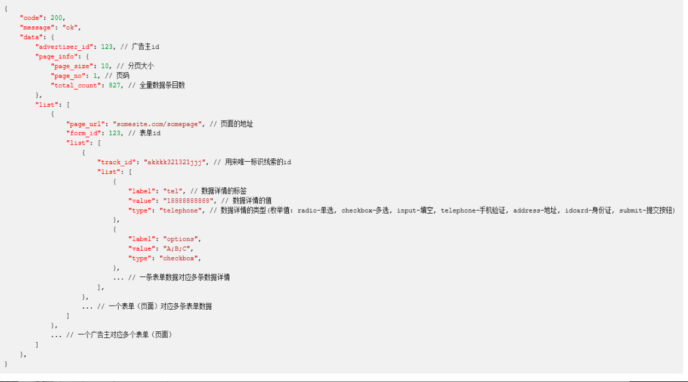
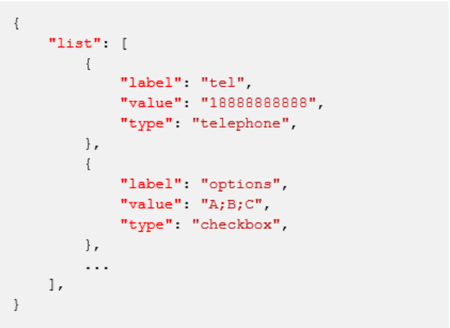

# 一、概述

- 为了优化广告主面向有效线索的投放，以及 Bilibili 赋能广告主使用 oCPX 优化有效线 索的成本，此文档介绍 Bilibili 与广告主之间的有效线索数据对接方案。


# 二、功能说明

## 名词解释:
- **线索**: 以获取用户线索为投放目的的广告主在Bilibili投放收集到的可跟进的用户信 息，通常以手机号码为载体。
- **有效线索**: 广告主对收集到的用户信息跟进后，认为对所投放产品有了解或购买意 向的用户信息。
- **API**: 程序接口，用于实现 Bilibili 与广告主的数据传输

# 三、方案概述

> 状态回传分为使用 Bilibili 自建站制作的落地页和使用其他外部建站工具落地页两种情况:
>> 使用 b 站建站工具落地页得到的表单:
1. 广告主上报自己在 b 站的账户 ID(account_id);
2. b 站会生成并下发一个密钥给广告主(用户提供账户给到 B 站运营同学)
3. 每次请求前, 广告主根据【签名生成算法】生成一个签名;
4. 广告主使用查询条件(广告主 Id 和时间范围)和签名共同组成参数请求b站服务器，并得到线索数据详情;
5. 广告主通过内部比对线索数据得到线索的状态;
6. 广告主使用 trackid 和状态作为参数请求 b 站服务器接口，回传线索数据。
>> 使用其他外部建站工具:
1. 广告主在创意页链接 URL 后配置__TRACKID__宏参数以达到在点击请求的
时候获取 trackid:示例:https://www.bilibili.com?track_id=__TRACKID__
2. 广告主使用 trackid 和状态作为参数请求 b 站服务器接口，回传线索数据。


# 四、获取 b 站建站工具表单页线索数据详情(API1)
- 请求方: 广告主
- 处理方: b站服务器
- 请求方法: GET
- 请求地址: https://cm.bilibili.com/mgk/api/open_api/v1/clues/get
- 请求参数:

|字段|类型|描述|
|:-|:-|:-|
|advertiser_id|string|广告主 id|
|start_time|string|查询起始时间，格式:yyyy-MM-dd; 默认6天前(即获取最近七天的内容)|
|end_time|string|查询截止时间，格式:yyyy-MM-dd; 默认当天|
|page_no|number|页码，默认: 1|
|page_size|number|页面大小 默认值: 10|
|ts|number|时间戳|
|sign|string|签名(字母小写)|

- 返回值:
- 

- 请求示例:
```sh
https://cm.bilibili.com/mgk/api/open_api/v1/clues/get?advertiser_id=376629 &ts=1608709393&page_no=1&page_size=10&start_time=2020-12- 23&end_time=2020-12-23&sign=b222929c7576e92ce641d2c5a7023d34
```

# 五、更新线索状态(API2)

- 请求方:广告主
- 处理方:b 站服务器
- 请求地址: https://cm.bilibili.com/mgk/api/open_api/v1/clues/update
- 请求参数:
|字段|类型|描述|
|:-|:-|:-|
|track_id|string|追踪 id|
|clue_state|number|线索状态(枚举值 1->有效 2->无效)|

- 请求正文(可选，仅用来回传外部建站工具的详细数据):

- 

- 回调示例:
```sh
https://cm.bilibili.com/mgk/api/open_api/v1/clues/update?track_id=MkPeuXp 4Hst6S74klNNwiC9moFW23Im4C45yglMsHep8rpZcuqoPVGjNRaTRjyg1eypWOCg 7NkBixUNYTpWD6KOYN_eKhqGffEKS5nkcg_aNa0gLHW4_ZUFxgM0aIVXgx3OdkFr APRcmL5M4bTkFw-9GUvYQxbgOVUth-wD9PQFEV- c_G8pSk2f4PrX8LuwPtrAe7B_M57tnXX1Vu_TUg%3D%3D_01&clue_state=1
```

# 六、签名算法
> 描述:
>> 1. 把所有查询参数的值和密钥放入一个集合;
>> 2. 把这些值转化为字符串, 然后排序;
>> 3. 排序方式是字符串排序, 首先比较首字母的编码(比如 ascii 码)顺序, 如果
相同, 就继续比较第二个字母的编码顺序, 以此类推, 大多数语言都有内建
的字符串排序函数;
>> 4. 把这些字符串用"&"连接成一个字符串;
>> 5. 计算这个字符串的 md5 值, 得到的结果即为签名。
> 例子:
>> 参考
```sh
参数：
	1. advertiser_id = '3'
	2. start_time = '2021-01-01'
	3. end_time = '2021-01-02'
	4. page_no = 1
	5. page_size = 10
	6. ts = 1611905162
	7. sign ='683f275e-a4d8-4621-a7db-72ace90aefa6'

计算过程:
md5('1&10&1611905162&2021-01-01&2021-01-02&3&683f275e-a4d8-4621-a7db-72ace90aefa6') = '26dd3f53a34cdef288d6152f9d72ef16'
```
>> java代码示例
```java
import org.apache.commons.codec.digest.DigestUtils;
import java.util.List;
import java.util.Objects;
import java.util.stream.Collectors;
public class Sign {
	public String sign(List<Object> params) {
		return DigestUtils.md5Hex(params.stream()
			.filter(Objects::nonNull)
			.map(Object::toString)
			.sorted().collect(Collectors.joining("&")));
} }
```
>> python代码示例
````python
from hashlib import md5
def sign(*args):
	str_args = [str(x) for x in args if x is not None] str_args.sort()
	str_sign = bytes('&'.join(str_args), 'utf8')
	m = md5()
	m.update(str_sign)
	return m.hexdigest()
````

# 七、Q&A

## 运营联调测试流程:
1. 将配置好 trackid 的落地页链接填写至投放平台创意落地页(填写在 DMP 监 测地址处无效)下(使用建站工具客户直接使用建站工具页面) 示例:https://www.bilibili.com?track_id=__TRACKID__
2. 客户技术同学完成回调线索和 B 站请求接口的配置(使用建站工具落地页对接 的客户需要像运营同学申请密钥一同回调，外链落地页客户不需要申请)
3. 运营同学通过预览广告形式，联调测试通路是否正常回调
4. 联调后，运营同学告知 B 站产品同学查询是否收到线索回传

## 对广告主有什么价值?
1. 关注有效线索成本的广告主将可以在投放后台实时直观了解有效转化数
据，便于优化投放策略;
2. 线索实时回传至广告主的 CRM，免去繁琐的线下导数录入成本;
3. 后续可使用 oCPX 直接以有效线索为目标进行优化，保障有效线索成本。

## 不使用 Bilibili 建站工具的表单能力可以对接有效线索吗?
1. 可以

## 了解完这份文档后我该干什么?
1. 此文档为面向业务的介绍，用于帮助广告主的业务同学了解对对接的价值
以及对己方 CRM 的需求。故明确价值和需求后，请联系对接的 Bilibili 广 告运营同学，开始正式对接。