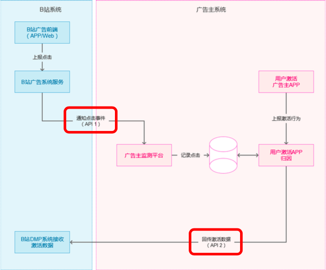
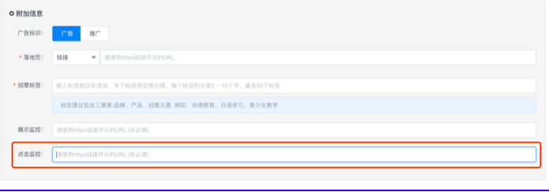

# 一、概述

* 为了满足 B 站广告主对广告效果的监测需求，本文档介绍如何将 B 站移动 APP 广告 渠道分发的 APP 激活、注册或者付费数据回传给 B 站广告平台，帮助广告主跟踪整个广 告的转化效果。
* 回调方案适用于 Android 和 iOS

# 二、功能说明
## 2.1 名词解释

* >**广告点击:** 
	* 当 B 站用户点击一个广告的素材(如标题、图片、按钮、视频)时，触发 点击事件。进入广告落地页后的点击行为不作为广告点击。

* >**应用激活:**
	* 用户安装 APP 后首次联网;应用激活发生的时间即激活时间 

## 2.2 方案概述

* 当广告主与 B 站完成回传数据 API 对接后，双方即可进行广告点击和激活数据的互 通。
* 广告点击时，B 站向广告主发送点击事件通知，广告主监控到用户激活时归因到点击 来源为 B 站(建议归因往前搜索的时长为 7 天)，则向 B 站接口返回此条激活信息;此种 模式下，B 站广告投放系统可以统计到分创意的激活数据。
* 对接后的功能流程可以用下图表示:



* 一般的对接流程如下:
1. 广告主确定对接模式没有问题后，双方技术产品同学拉群讨论。
2. 广告主针对 B 站 API 进行开发。
3. 广告主在 B 站投放后台填写监测地址。
4. 双方联调:
	1. 通过投放平台预览模式测试，预览广告后，在客户端点击广告。看广告主是 否正确收到 B 站发来的点击数据。
	2. 向 B 站 API2 接口模拟激活回调，如返回码为 0，则表示成功接收。
	3. DMP 后台会显示当天的预览的转化数，可参考对照是否与测试的激活数一
致。如一致，则对接成功，可进行线上小规模投放验证。

## 2.3 点击上报介绍

> 接口简介:

|||
|-|-|
|请求方| b站客户端|
|处理方|广告主提供的监测平台服务器|
|请求协议|https/http 协议|
|请求地址|即点击监测地址，广告主在广告投放平台中提供监测 URL。|

> 典型的上报地址示例如下，回调参数可借鉴如以下配置:
```shell
http:/url/advstat/track/bili_feedback_url?trackid=__TRACKID__&crid=__CREATI VEID__&os=__OS__&model=__MODEL__&mac=__MAC1__&idfa=__IDFA__&ip=__IP __&ua=__UA__&click_ts=__TS__
```
> 其中调用方可自定义参数名称，API1 中关于广告主如何定义参数名，B 站并不做限 制，仅将广告主提供的链接中的宏按规则进行替换。宏的定义参考下文表格, 点击监测地址支持的宏参数列表如下:

|字段名称|含义|格式和示例|替换|
|-|-|-|-|
|\_\_TRACKID__|用于追踪来源广告的追 踪ID|一段用于检索广告来源的随机 字符串，请保留原始值，用于 在 API2 中返回给 B 站。一般在 500 个字符之内。| <span style="color:red">是</span>|
|\_\_ACCOUNTID__|B 站账户 ID，用于广告 主与自己平台上的账户 进行映射|数字字符串，一般在50个字符之内。|<span style="color:red">是</span>|
|\_\_CAMPAIGNID__|B 站计划 ID，用于广告 主与自己平台上的账户 进行映射|数字字符串，一般在 50 个字符之内|<span style="color:red">是</span>|
|\_\_UNITID__|B 站单元 ID，用于广告 主与自己平台上的账户 进行映射|数字字符串，一般在 50 个字 符之 内。|<span style="color:red">是</span>|
|\_\_CREATIVEID__|B 站创意 ID，用于广告 主与自己平台上的创意 进行映射|数字字符串，一般在 50 个字符 之内。|<span style="color:red">是</span>|
|\_\_OS__|客户端操作系统|数字,取 0~3。0 表示 Android， 1 表示 iOS，2 表示 Windows P hone，3 表示其他|<span style="color:red">是</span>|
|\_\_IMEI__|用户终端的 IMEI|原始值为 15 位 IMEI，取其 32 位 MD5 摘要。|取到时替换|
|\_\_CALLBACKURL__|回调地址(需要 urlencode)|字符串，需 urlencode编码，如 https://cm.bilibili.com/conv /api/conversion/ad/cb/v1?track_id=__track_id__ ,(回传链接 中 track_id 会替换成对应值)|<span style="color:red">是</span>|
|\_\_MAC1__|用户终端的 eth0 接口 的MAC地址|保留分隔符”:”的大写 MAC 地 址，取其32位MD5摘要|取到时替换|
|\_\_IDFA__|iOS IDFA，适用于iOS 6 及以上|IDFA 原始值。32 位十六进制数 字+4 位连接符"-"。|取到时替换|
|\_\_CAID__|中广协 CAID|因 CAID 有版本差别，需将版本 号(若无版本号请使用 0)和值用' _'拼接后替换,如果有多个用','拼 接(最多携带 2 个版本),然后用 U RLEncode;如 20201201_bfb4 05dc6c3b16e8b1ba40bcd3a7 c7c4%2c20210101_e8b1ba40 bcd3a7c7c4bfb405dc6c3b16|取到时替换|
|\_\_AAID__|Android Advertising ID|保留原始值。|取到时替换|
|\_\_ANDROIDID__|用户终端的Android ID|原始的Android ID，取其32位 md5 摘要|取到时替换|
|\_\_OAID__|匿名设备标识符|原始的 OAID，最长 64 位。|取到时替换|
|\_\_IP__|投放系统服务器观察到 的用户远程 IP|A.B.C.D(4 段点分)，如 12.34.5 6.78|取到时替换|
|\_\_UA__|数据上报终端设备的 User Agent|字符串，需 escape 转义，如 Mozilla%2F5.0(Linux%3BAndroid4.0.4%3BGT -I9220%20Build%2FIMM76D)|取到时替换|
|\_\_MODEL__|手机型号|仅提供iPhone手机型号(如:IP hone 6s Plus)|取到时替换|
|\_\_TS__|客户端触发监测的时间|UTC 时间戳，自1970年起的毫秒数|<span style="color:red">是</span>|
|\_\_SHOPID__|店铺 ID|数字|取到时替换|
|\_\_UPMID__|视频UP主MID|数字|取到时替换|

> <span style="color:red"> *注意:* 参数名广告主可自定义，并选择所需要的宏进行参数值的获取。如需要做激活回 传，“__TRACKID__”为必填宏，其值在 API2 回传中使用。</span>

> 回调地址在 B 站投放后台创建创意时填写，作为向广告主<span style="color:red">发送点击事件</span>的固定地址。


> 一个 B 站广告服务端发出的 API1 请求案例:
```shell
http://XXX.com/callback/bilibili?click_time=1519626045000&client_ip=10.23.60.13 8&device_type=2&imei=b72c9cbd09706fc9b686a6421b4875ca&track_id=WZNsJ EC1cc2r2QYqhdSWs307tAhHX4CRfff8NEm4N_ckdjdQ4kUll6446qhbDHbkMvfUSYw EM7S2G3I6dmRlAB8tSZ5g- M4_uHJmHKV8aTBMpYVIYKAuGl1ri7VXy5h__1retObLe- SMdcEBTWlXRF400fWayyMhKCfPJrkZl5c=_01
```
* API1 若调用成功，服务端应返回 http code 200，表示接收成功。


## 2.4 转化回传接口(API2)介绍

1. 广告主产生某种转化行为的时候，调用回传 API 对 B 站 API2 接口进行数据上报。

2. 回传的转化记录将通过 TrackID 与历史广告的点击行为进行关联，从而记录在广告主 的相关记录中，用于后续 DMP 服务，及投放系统的报表展示。
* 接口简介:

|请求方|广告主服务器|
|:-|:-|
|处理方|B 站广告服务器(cm.bilibili.com)|
|请求协议|https 协议| 
|请求地址|https://cm.bilibili.com/conv/api/conversion/ad/cb/v1?|

* 典型的请求 URL 为:
```html
https://cm.bilibili.com/conv/api/conversion/ad/cb/v1?conv_type=APP_FIRST_ACTI VE&conv_time=......
```
|回传字段|字段说明|字段取值(对广告应投放平台指标字段/是否支持 oCPX 优化)|必填|
|:-|:-|:-|:-|
|conv_type|转化类型|字符串，可选取值如下(都是大写)"APP_DOWNLOAD":APP 下载成功(安卓下载数 /支持“安卓下载”);"APP_INSTALL":APP 安装成功(安卓安装数/支 持“安卓安装”); "APP_FIRST_ACTIVE":APP 首次激活(安卓或 IOS 激活数/支持“应用激活”); "APP_ACTIVE":APP 激活但不是首次激活回传 这个值(安卓或 IOS 激活数/不支持); "FORM_SUBMIT":表单提交(表单提交数/支持 “表单提交”); "USER_REGISTER":用户注册(注册数/支持“用 户注册”);"ADD_TO_CART":加入购物车; "ORDER_PLACE":提交订单(提交订单数【电商 行业】/不支持); "USER_COST":完成付费行为(支付订单数/不支 持);"USER_RESERVE":用户参与某个活动预订; "RETENTION":用户留存(次日留存数/不支持); "APP_CALLUP":调起成功(调起成功数/不支 持); "FORM_USER_COST":教育完成表单付费行 为(表单付费/支持); “ACCOUNT_SUBSCRIBE”:账号关注|<span style="color:red">是</span>|
|conv_time|转化事件发生时间|转化的时间。UTC 时间戳，自 1970 年起的毫秒数|<span style="color:red">是</span>|
|track_id|用于追踪来源广告的追 踪ID|API1 中传给广告主的追踪 ID。|<span style="color:red">是</span>|
- 一个广告主服务端发出的 API2 请求案例:
```sh
https://cm.bilibili.com/conv/api/conversion/ad/cb/v1?conv_type=APP_FIRST_ ACTIVE&conv_time=1529741853000&track_id=MkPeuXp4Hst6S74klNN wiC9moFW23Im4C45yglMsHep8rpZcuqoP-VGjNRaTRjyg1eypWOCg7NkBixUNYTpWD6KOYN_eKhqGffEKS5nkcg_aNa0gLHW4_ ZUFxgM0aIVXgx3OdkFrAPRcmL5M4bTkFw-9GUvYQxbgOVUth-wD9PQFEV- c_G8pSk2f4PrX8LuwPtrAe7B_M57tnXX1Vu_TUg%3D%3D_01
```
- API2 调用后，若调用成功，返回 http code 200，并返回一个 Json 字符串，具体格 式如下:
```js
{
	"code":0, 		// 返回码， 0 为正常，400 为缺少必填参数
	"message":"", 	// 返回信息，发生异常时为异常提示
	"data":"" 		// 备注数据， 一般为空
}
```
* 若调用超时，需要重试三次。


## 三、Q&A:

## 1. Q .运营联调测试流程:

1. 将配置好宏参数的落地页链接或监测链接填写至投放平台<span style="color:red">创意下落地页或监测链接位 置(若同一个监测链接也可以填写在 DMP 监测地址)下:
```sh
http:/url/advstat/track/bili_feedback_url?trackid=__TRACKID__&crid=__CREATI VEID__&os=__OS__&mac=__MAC1__&idfa=__IDFA__&ip=__IP__&ua=__UA__&c lick_ts=__TS__
```

 2. 运营同学通过投放平台预览广告形式，联调测试通路是否正常回调
 
 3. 在 DMP 后台查询预览数是否变化，与客户接收到的数据是否一致 <span style="color:red">(若不一致则与客户 确认回传转化时间是否存在多个，导致平台不完全依赖于设备号去重，从而造成多个转化出现)</span>
	

## 2. Q:客户预览测试时，点击广告后回传链路的自查方法?
-  A: <span style="color:red">第一步</span>:检查是否收到 B 站服务器下发的点击请求，未收到则需要客户自行检查监 测链接在浏览器下是否可以正常访问;
-  <span style="color:red">第二步</span>:若收到点击请求，则校验是否收到设备号(其 中，安卓设备号 IMEI 的获取属于用户针对 B 站 APP 自愿打开访问设备权限问题，因此， 在测试时，需运营同学确保手机权限是否打开，同时，针对安卓投放，建议使用 OAID+IMEI 共同归因);
- <span style="color:red">第三步:</span>确认调用 B 站接口链接和宏替换后的参数是否拼接正确(包括必带的 trackid、client_ip、conv_type、conv_time)

## 3. Q:点击上报时没有 IMEI、OAID 或 IDFA 如何归因?
- A: 在获取不到 IMEI、OAID 或 IDFA 的情况下，可以采用 IP+UA 来辅助归因，安卓
端还能通过 Android ID 来进行辅助归因。

## 4. Q:是不是只能回传激活?
- A: 不是，参考文档 API2 接口中“conv_type”参数，我们支持:APP 首次激活、 APP 激活但不是首次激活回传这个值、用户注册、加入购物车或者下单、完成付费行 为、用户参与某个活动预订等.

## 5.Q:一个客户如果有多个账户，是否每个账户都需要重新对接?
- A: 一般只需要技术对接一次，然后对每个账号进行相关的 API1 地址配置即可。

## 6.Q:__TRACKID__和__CREATIVEID__是如何获取的?
- A:当点击 B 站广告时，B 站服务器会上报该宏参数值，通过监测链接带给广告主。

## 7.Q:IMEI、OAID、IDFA、UA 等信息，在点击请求上报时，是上报原始值还是加密后 的值?
- A:IMEI、UA 都是 encode 加密后的值，IDFA 、OAID 上报原始值。

## 8.Q:当宏参数位获取不到时，上报的是空值还是未被替换的原始宏参数?
- A:未被替换的原始宏参数。

## 9.Q:当联调测试回调 B 站接口时，若广告主随意生成的 trackid 进行回调测试，B 站服 务器是否可以接收到回调数据?
- A:不可以，trackid 是通过 B 站服务器通过某种计算方式下发的唯一值。

## 10.Q:API 文档是否可以用来对接“表单提交”转化类型的外链落地页客户?
- A:可以的，但需要通过 JS-SDK 对接埋点方式对接，回调时可以使用 API 文档中的接 口地址和对应的 conv_type 转化类型。

## 11.Q:点击监测链接是填写在 DMP 后台还是创意下监测链接位置?
- A:当点击监测链接唯一时，填写在投放平台创意监测位置和 DMP 监测地址位置都 可以(但建议填写在创意下监测链接位置);当点击监测链接不唯一时，填写在投放平台创 意监测位置下

## 12.Q:针对 ocpx“应用激活”优化目标，需要 conv_type 回传哪个转化类型?
- A:需要回传<span style="color:red">"首次激活"</span>字段.

## 13. Q: 对于安卓 10 以上，设备号 OAID 的监测链接填在哪里能够获取到这个值?
- A: 对于 OAID 的获取目前需统一填写在投放平台创意监测链接的位置

## 14. Q: 客户与媒体的监测代码是 C2S 还是 S2S 方式回传?
- A: 当监测链接填写在 DMP 监测地址处就是 s2s，而监测链接填在投放平台创意监测 链接位置处就是 c2s

## 15. Q: 无法获取 IDFA 请况下归因方式?
- A: 若已对接中广协 CAID，可使用 CAID;若无，可使用 UA+IP+model
