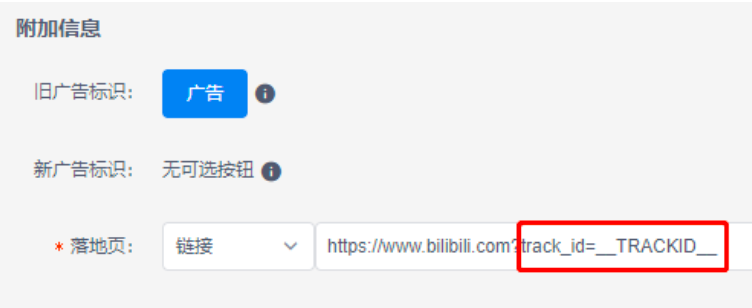
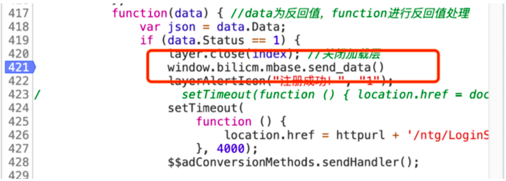

- [一、落地页地址增加 track_id 参数](#一落地页地址增加-track_id-参数)
- [二、在落地页调用 B 站提供的 js-sdk](#二在落地页调用-b-站提供的-js-sdk)
	- [**第一步**: 在模版页面中，使用 script 标签引用:](#第一步-在模版页面中使用-script-标签引用)
	- [**第二步**:当触发上报条件后，调用回调函数上报数据，我们提供了两套回调函数:](#第二步当触发上报条件后调用回调函数上报数据我们提供了两套回调函数)
	- [**第三步**:SDK 会自动收集数据(无需操作):](#第三步sdk-会自动收集数据无需操作)
  
# 一、落地页地址增加 track_id 参数
- 在**投放端后台创意落地页地址处(DMP 后台无效)**填写的**落地页地址中增加 track_id参数**  
- 并且该参数取值为__TRACKID__
- 示例:https://www.bilibili.com?track_id=__TRACKID__

**请务必确保到落地页时，url中含有"track_id"字段。**

# 二、在落地页调用 B 站提供的 js-sdk

## **第一步**: 在模版页面中，使用 script 标签引用:
> https://s1.hdslb.com/bfs/cm/cm-sdk/static/js/track-collect.js

## **第二步**:当触发上报条件后，调用回调函数上报数据，我们提供了两套回调函数:
	1. 推荐回调函数:window.bilicm.mbase.report_data()
      	1. 调用方法:sendBeacon & 图片 Ping
      	2. 说明:该方法适用于点击按钮后需要跳转的场景。
      	3. **建议优先使用window.navigator.sendBeacon方法 post形式上报数据**，如不支持，降级使用图片url， get形式上报
          - 请求参数： null
          - 调用示例：
          - 
	2. 备用回调函数:window.bilicm.mbase.send_data():
		1. 调用方法:图片 Ping
		2. 说明:对于点击后有跳转的情况，该方案有较大的数据发送失败的风险，需要做延迟跳 转，等上报成功后再跳转至新页面。
			- 请求参数:null
			- 调用示例:
         	- 
## **第三步**:SDK 会自动收集数据(无需操作):
  
|参数名|必选|类型|说明|
|:-|:-|:-|:-|
|conv_type|是|转化类型|字符串，此 SDK 默认:"FORM_SUBMIT";|
|conv_time|是|转化事件发生时间|转化的时间。UTC 时间戳，自 1970 年起的毫秒数|
|client_ip|是|设备的联网公网IP|四段点分(A.B.C.D)，由后端自行获取|
|track_id|是|用于追踪来源广告的追踪ID|从 h5 页面的 url 中获取|
|ua|否|数据上报用户终端 设备的 User Agent|字符串，需 escape 转义，如: Mozilla%2F5.0(Linux%3BAndroid4.0.4%3BGTI9220%20B uild%2FIMM76D )|